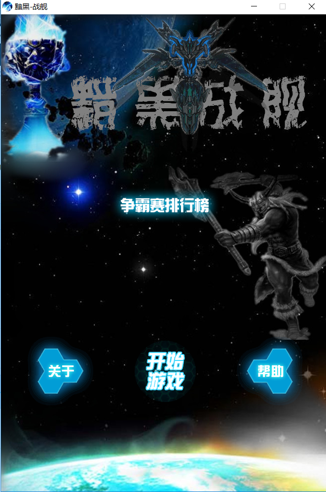
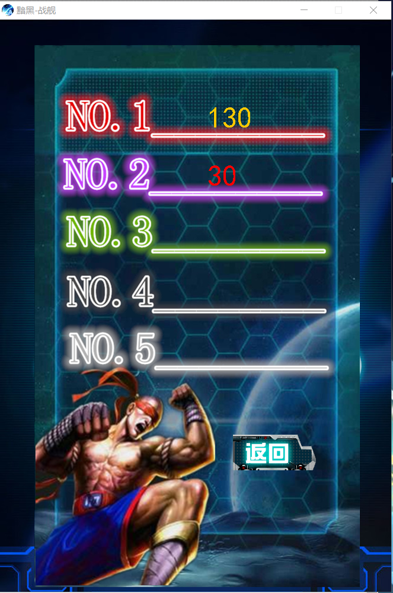
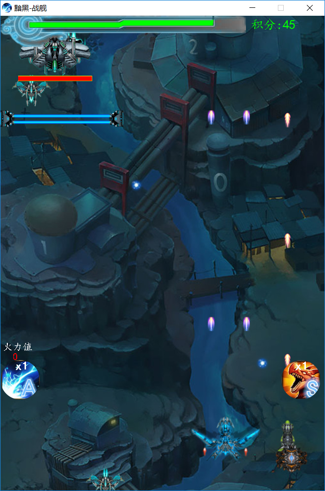
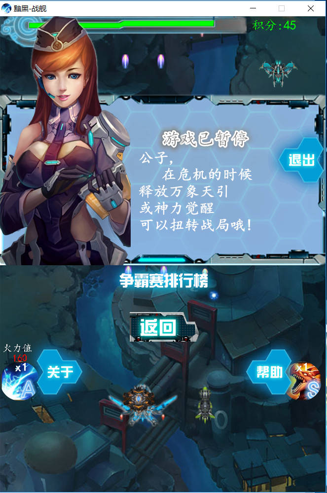
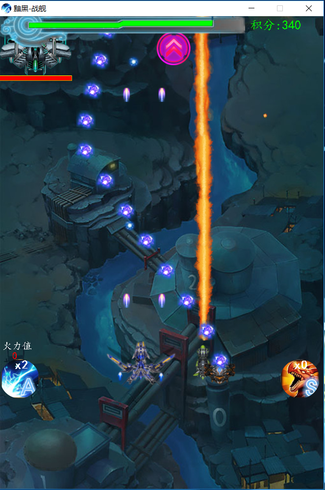
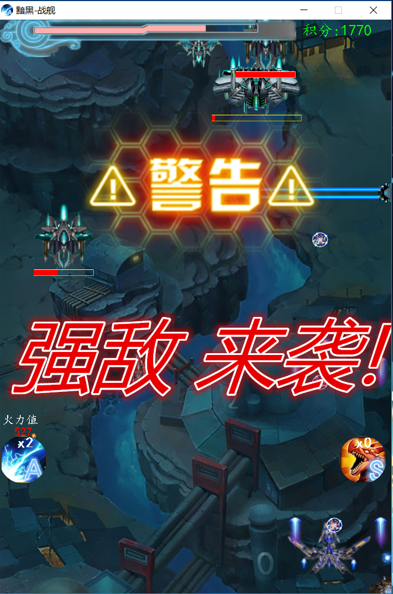
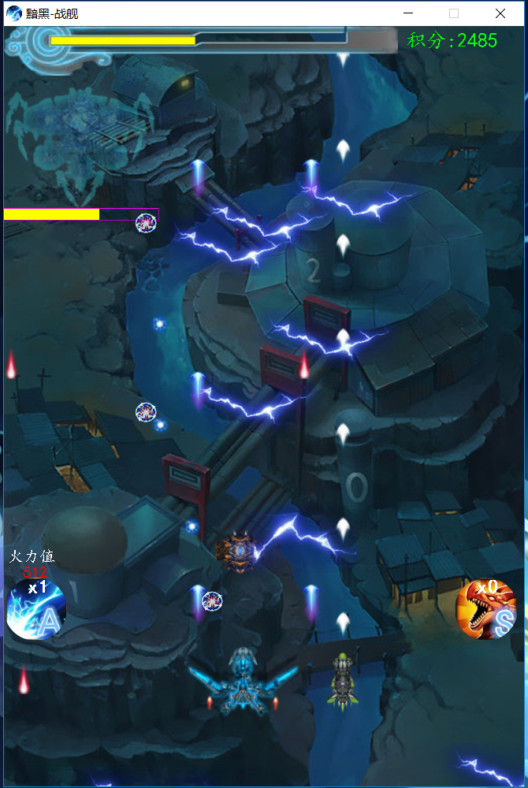
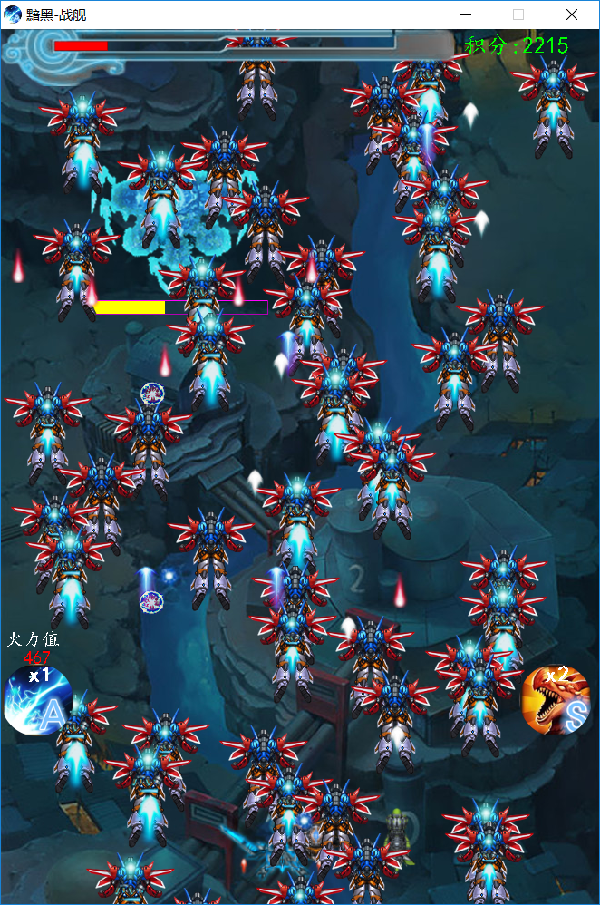
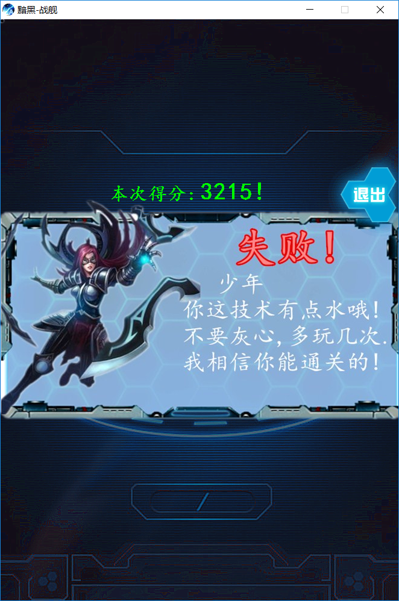

# TuShoot / 黯黑战舰 / 飞机大战
### 声明
>部分图片/声音 素材来自于网络,如有侵权请联系作者删除
>邮箱 2388791326@qq.com
## 简单介绍
>为项目评比所准备的一个游戏项目,花了一些心思.其中各种构思,找图抠图,找音效
<br/>实现功能的时候各种 debug,想各种算法 三角走位的 BOSS 散发的子弹 追踪的子弹
<br/>还有遇到了一些没有用过的 API ,先用 api 写 test 然后才用到项目中
<br/>删删改改的代码超过 1w,最终留下来的 只有4,5K 代码
<br/>项目基本完成时还要考虑 游戏平衡,还有...

## 技术涉及
>Java 多线程,定时任务
<br/>Java swing (Jpanel Jfram 界面 Jbutton 按钮)
<br/>Java awt 中 图片绘制 和 键盘事件
<br/>Java applet 中的 audio 音乐播放

## 开发环境
- jdk 8
- windows 10

## 如何运行
- jdk 7及其以上
- 程序入口 TuShoot\shoot\core\World.java
- 也可以用 exe4j 打包成 exe 运行 或是 打成 jar 运行

## 项目截图

- 进入游戏
- 游戏排行
- 开始游戏
<figure class="third">



</figure>

- 游戏暂停
- 释放技能
- boss警告
<figure class="third">



</figure>

- 释放技能
- 低血线援助
- 游戏结束
<figure class="third">



</figure>

## 项目目录结构
```
│  .classpath
│  .project
│  README.MD
│  score
│  游戏说明.txt      
├─readme				项目介绍所用资源
└─shoot
    ├─audio_png			对外提供游戏图片以及背景音乐/音效

    │  ├─Bgm&Effec		游戏音效以及背景音乐

    │  └─pictures&		游戏单位的图片

    ├─bullet			封装游戏子弹

    ├─button			封装游戏按钮

    │  └─button-p		按钮图片

    ├─core    			核心类所在包

    ├─enemy				封装所有敌人

    ├─friends			封装所有友军

    ├─key_borad			封装所有键盘事件

    └─score				游戏分数
```
